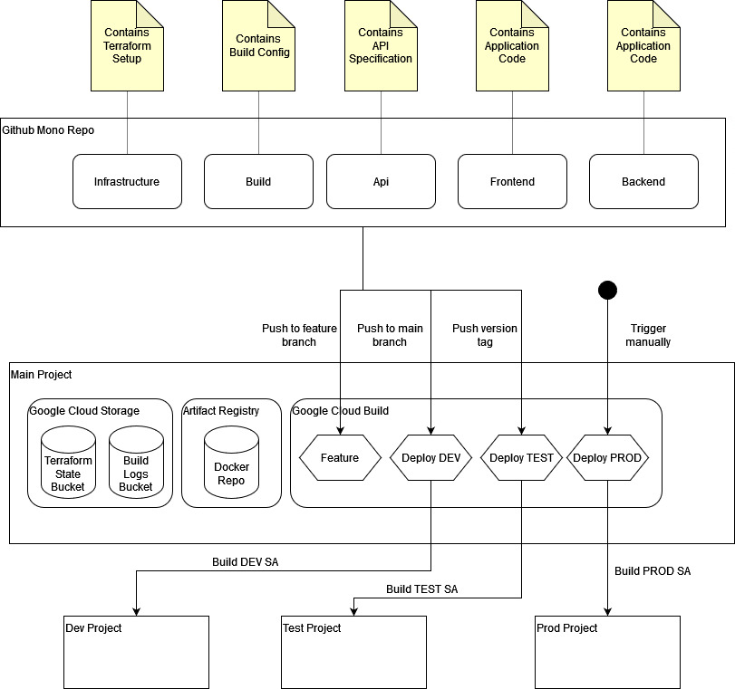

# Bonsai

A collection of terraform modules to facilitate Google Cloud development.

## Potential Usage

A potential multi-stage and multi-project setup for Google Cloud using Terraform and a git mono repo.
